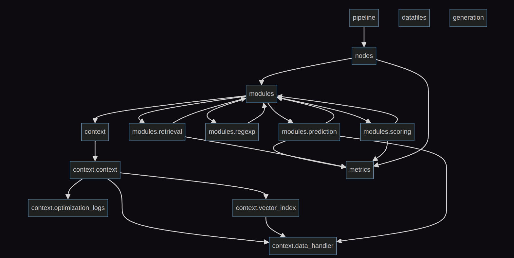

# Contribute to AutoIntent

## Минимальная конфигурация

Мы используем `poetry` в качесте менеджера зависимостей и упаковщика.

1. Установить `poetry`. Советуем обратиться к разделу официальной документации [Installation with the official installer](https://python-poetry.org/docs/#installing-with-the-official-installer). Если кратко, то достаточно просто запустить команду:
```bash
curl -sSL https://install.python-poetry.org | python3 -
```

2. Склонировать проект, перейти в корень

3. Установить проект со всеми зависимостями:
```bash
make install
```

## Дополнительно

Чтобы удобнее трекать ошибки в кодстайле, советуем установить расширение ruff для IDE. Например, для VSCode
```
https://marketplace.visualstudio.com/items?itemName=charliermarsh.ruff
```
С этим расширением ошибки в кодстайле будут подчеркиваться прямо в редакторе.

В корень проекта добавлен файл `.vscode/settings.json`, который указывает расширению путь к конфигу линтера.

## Contribute

1. Создать ветку, в которой вы будете работать. Чтобы остальным было проще понимать характер вашего контрибьюта, нужно давать краткие, но понятные названия начинающиеся. Советем начинать названия на `feat/` для веток с новыми фичами, `fix/` для исправления багов, `refactor/` для рефакторинга, `test/` для добавления тестов.

2. Коммит, коммит, коммит, коммит

3. Если есть новые фичи, желательно добавить для них тесты в директорию [tests](./tests).

4. Проверить, что внесенные изменения не ломают имеющиеся фичи
```bash
make test
```

5. Проверить кодстайл
```bash
make lint
```

6. Ура, можно открывать Pull Request!

## Устройство проекта



## Настройка логгера
Чтобы видеть debug строчки у вас есть несколько опций:

1. Включить весь debug output через опцию коммандной строки: 
```bash 
autointent hydra.verbose=true
```
2. Включить debug output только для определенных модулей, пример для autointent.pipeline.optimization.cli_endpoint и самой hydra: 
```bash
autointent hydra.verbose=[hydra,autointent/pipeline/optimization/cli_endpoint] hydra.job_logging.root.level=DEBUG
```

Само конфигурирование логгера сделано в autointent.configs.optimization_cli.logger_config. Вы можете изменить любой параметр логгера через коммандную строку. Вот пример, как поменять уровень логгера на ERROR:
```bash
autointent hydra.job_logging.root.level=ERROR
```

Еще можно изменить параметры логгера через yaml файлы:
1. Создадим папку с конфиг. файлами: test_config
2. test_config/config.yaml:
```yaml
defaults:
  - optimization_config
  - _self_
  - override hydra/job_logging: custom
  
# set your config params for optimization here
embedder_batch_size: 32
```
3. Поместите конфигурацию логгера в test_config/hydra/job_logging/custom.yaml (параметры см. [здесь](https://docs.python.org/3/howto/logging.html))
4. Запускаем с конфиг файлом config.yaml:
```bash
autointent --config-path FULL_PATH/test_config --config-name config
```