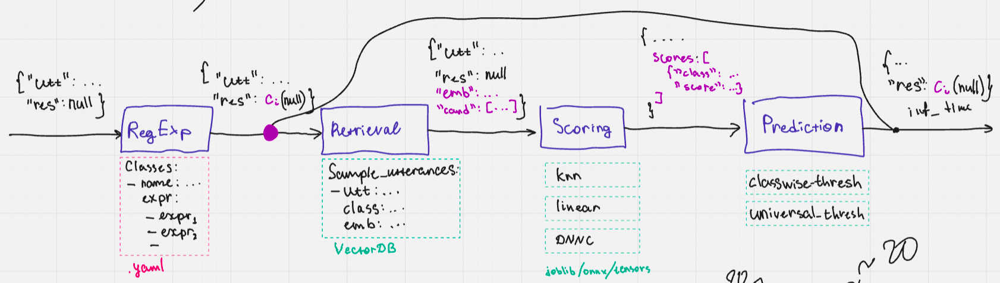

# AutoIntent

Инструмент для автоматической конфигурации пайплайна классификации текстов для предсказания интента. Построен на представлении о том, что алгоритм предсказания интента можно разбить на четыре шага (TODO обновить схему):



1. RegExp: классификация простейших примеров, которые описываются регулярными выражениями
2. Retrieval: поиск похожих текстов, для которых известна метка класса
3. Scoring: оценка принадлежности каждому из классов
4. Prediction: предсказание метки класса и детекция out-of-scope примеров

## Установка

1. Скопировать проект:

```bash
git clone https://github.com/voorhs/AutoIntent.git
cd AutoIntent
```

2. Установить пакет:

```bash
pip install .
```

## Использование

В текущей alpha-версии оптимизацию можно запустить командой `autointent`:
```
usage: autointent [-h] [--config-path CONFIG_PATH]
                  [--multiclass-path MULTICLASS_PATH]
                  [--multilabel-path MULTILABEL_PATH] [--test-path TEST_PATH]
                  [--db-dir DB_DIR] [--logs-dir LOGS_DIR]
                  [--run-name RUN_NAME]
                  [--mode {multiclass,multilabel,multiclass_as_multilabel}]
                  [--device DEVICE] [--regex-sampling REGEX_SAMPLING]
                  [--seed SEED]
                  [--log-level {DEBUG,INFO,WARNING,ERROR,CRITICAL}]
                  [--multilabel-generation-config MULTILABEL_GENERATION_CONFIG]

options:
  -h, --help            show this help message and exit
  --config-path CONFIG_PATH
                        Path to a yaml configuration file that defines the
                        optimization search space. Omit this to use the
                        default configuration.
  --multiclass-path MULTICLASS_PATH
                        Path to a json file with intent records. Set to
                        "default" to use banking77 data stored within the
                        autointent package.
  --multilabel-path MULTILABEL_PATH
                        Path to a json file with utterance records. Set to
                        "default" to use dstc3 data stored within the
                        autointent package.
  --test-path TEST_PATH
                        Path to a json file with utterance records. Skip this
                        option if you want to use a random subset of the
                        training sample as test data.
  --db-dir DB_DIR       Location where to save chroma database file. Omit to
                        use your system's default cache directory.
  --logs-dir LOGS_DIR   Location where to save optimization logs that will be
                        saved as
                        `<logs_dir>/<run_name>_<cur_datetime>/logs.json`
  --run-name RUN_NAME   Name of the run prepended to optimization logs
                        filename
  --mode {multiclass,multilabel,multiclass_as_multilabel}
                        Evaluation mode. This parameter must be consistent
                        with provided data.
  --device DEVICE       Specify device in torch notation
  --regex-sampling REGEX_SAMPLING
                        Number of shots per intent to sample from regular
                        expressions. This option extends sample utterances
                        within multiclass intent records.
  --seed SEED           Affects the data partitioning
  --log-level {DEBUG,INFO,WARNING,ERROR,CRITICAL}
                        Set the logging level
  --multilabel-generation-config MULTILABEL_GENERATION_CONFIG
                        Config string like "[20, 40, 20, 10]" means 20 one-
                        label examples, 40 two-label examples, 20 three-label
                        examples, 10 four-label examples. This option extends
                        multilabel utterance records.
```

Вместе с пакетом предоставляются дефолтные конфиг и данные (5-shot banking77 / 20-shot dstc3).

Примеры использования:
```bash
autointent --mode multiclass --multiclass-path default
autointent --mode multilabel --multilabel-path default
autointent --multiclass-path data/intent_records/ac_robotic_new.json \
        --mode multiclass_as_multilabel \
        --logs-dir experiments/multiclass_as_multilabel/ \
        --run-name robotics_new_testing \
        --regex-sampling 10 \
        --multilabel-generation-config "[0, 4000, 1000]"
autointent --multiclass-path data/intent_records/ac_robotic_new.json \
           --test-path data/intent_records/ac_robotic_val.json \
           --mode "multiclass_as_multilabel" \
           --regex-sampling 20
autointent --mode multiclass \
           --multiclass-path default \
           --test-path data/intent_records/banking77_test.json 
```

Пример входных данных в директории `data/intent_records`.

## Постановка задачи и формат входных данных

Решается задача классификации текста с возможностью отказа от классификации (в случае, когда текст не попадает ни в один класс).

Для решения этой задачи необходимо собрать для каждого интента словарик, подобный следующему:
```json
{
    "intent_id": 0,
    "intent_name": "activate_my_card",
    "sample_utterances": [
        "Please help me with my card.  It won't activate.",
        "I tired but an unable to activate my card.",
        "I want to start using my card.",
        "How do I verify my new card?",
        "I tried activating my plug-in and it didn't piece of work"
    ],
    "regexp_full_match": [
        "(alexa ){0,1}are we having a communication problem",
        "(alexa ){0,1}i don't think you understand",
        "what",
        "I did not get what do you mean"
    ],
    "regexp_partial_match": [
        "activate my card",
    ]
}
```

Расшифровка полей:
- `intent_id` метка класса (пока что поддерживается только консистентная разметка 0..N)
- `intent_name` опциональный параметр
- `sample_utterances` список реплик представителей данного класса
- `regexp_full_match` грамматика, описывающая представителей данного класса (используется затем в связке с `re.fullmatch(pattern, text)`)
- `regexp_partial_match` грамматика, описывающая только часть представителей данного класса (используется затем в связке с `re.match(pattern, text)`)

### Multilabel

Для решения задачи multilabel классификации, формат данный другой (см. примеры в `data/multi_label_data`).

## RegExp Node

\# in development

## Retrieval Node

Из входных данных извлекаются все `sample_utterances` со своими метками классов и помещаются в поисковый индекс. Этот индекс пригождается на шаге Scoring для модулей `KNNScorer` и `DNNCScorer`.

Результатом оптимизации этого компонента является поисковый индекс.

### VectorDBRetriever

Под капотом ChromaDB.

Гиперпараметры:
- название модели би-энкодера с huggingface
- число кандидатов для ретрива

## Scoring Node

Результатом оптимизации этого компонента является моделька, которая принимает на вход текст и выдает оценки принадлежности каждому классу.

### KNNScorer

Обычный метод ближайших соседей. Для поиска используется индекс, добытый на шаге Retrieval.

Гиперпараметры:
- число ближайших соседей

### LinearScorer

Обычная логистическая регрессия. В качестве признаков используются эмбединги из векторного индекса.

Гиперпараметры отсутствуют.

### DNNCScorer

Метод, заимствованный из статьи "discriminative nearest neighbor out-of-scope detection". Алгоритм:
1. Ретрив `k` соседей с помощью поискового индекса
2. Использование кросс-энкодера для оценки близости между текстом и `k` соседями
3. Выдать метку класса того соседа, который наиболее близок к текущему тексту по мнению кросс-энкодера

Гиперпараметры:
- название модели кросс-энкодера с huggingface
- число соседей `k`

## Prediction Node

Результатом оптимизации этого компонента является решающее правило, которое
- детектирует OOS
- выдает метку класса на основе оценок, полученных с этапа Scoring

### ArgmaxPredictor

Выдает метку того класса, скор которого не меньше всех остальных. Не детектирует OOS.

### ThresholdPredictor

Выдает метку того класса, скор которого не меньше всех остальных. Если скор этого класса меньше некоторого порога, то выдается OOS. Порог задается при инициализации модуля.

### JinoosPredictor

Выдает метку того класса, скор которого не меньше всех остальных. Если скор этого класса меньше некоторого порога, то выдается OOS. Порог подбирается автоматически с помощью оптимизации метрики jinoos, заимствованной из статьи DNNC.

## Оптимизация

Оптимизация пайплайна происходит путем независимой оптимизации каждого отдельного модуля под выбранную метрику. На текущий момент реализован метод полного перебора.

Для компоненты RegExp реализованы следующие метрики, цель которых проверить, что регулярные выражения разных интентов не конфликтуют:
- `regexp_partial_accuracy`
- `regexp_partial_precision`

### Multi-class классификация

Retrieval:
- `retrieval_hit_rate`
- `retrieval_map`
- `retrieval_mrr`
- `retrieval_ndcg`
- `retrieval_precision`

Scoring:
- `scoring_accuracy`
- `scoring_f1`
- `scoring_log_likelihood`
- `scoring_precision`
- `scoring_recall`
- `scoring_roc_auc`

Prediction:
- `prediction_accuracy`
- `prediction_f1`
- `prediction_precision`
- `prediction_recall`
- `prediction_roc_auc`

### Multi-label классификация

Retrieval:
- все те же метрики, но в формате макро усреднения (к названию метрики нужно добавить `_intersecting`):
    - `retrieval_hit_rate_intersecting`
    - `retrieval_map_intersecting`
    - `retrieval_mrr_intersecting`
    - `retrieval_ndcg_intersecting`
    - `retrieval_precision_intersecting`
- все те же метрики, но над бинарными метками, где 0 или 1 определяется тем, есть ли хотя бы одна общая метка (к названию метрики нужно добавить `_macro`):
    - `retrieval_hit_rate_macro`
    - `retrieval_map_macro`
    - `retrieval_mrr_macro`
    - `retrieval_ndcg_macro`
    - `retrieval_precision_macro`
    Scoring:
- все те же, но в формате макро усреднения (под теми же названиями):
    - `scoring_accuracy`
    - `scoring_f1`
    - `scoring_log_likelihood`
    - `scoring_precision`
    - `scoring_recall`
    - `scoring_roc_auc`
- `scoring_neg_ranking_loss`
- `scoring_neg_coverage`
- `scoring_hit_rate`

Prediction:
- все те же, но в формате макро усреднения (под теми же названиями)
    - `prediction_accuracy`
    - `prediction_f1`
    - `prediction_precision`
    - `prediction_recall`
    - `prediction_roc_auc`

## Roadmap

| Version | Description                                               |
| ------- | --------------------------------------------------------- |
| v0.0.x  | Python API, CLI API, Greedy optimization                  |
| v0.1.x  | Web UI for logging, Bayes optimization, data augmentation |
| v0.2.x  | Optimization presets, improved efficiency                 |
